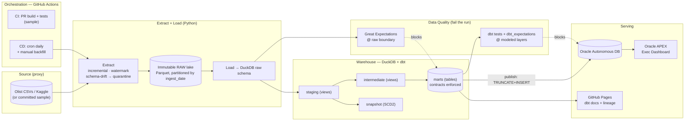
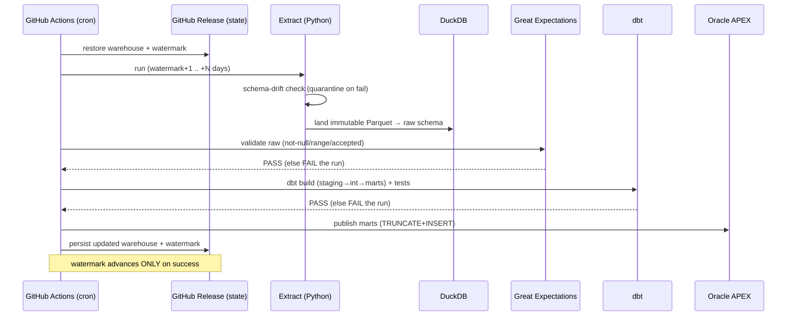

# Retail Sales & Inventory ELT — A Trusted Daily Source of Truth

[](https://github.com/pablodepaola/retail-elt-pipeline/actions/workflows/ci.yml)
[](https://github.com/pablodepaola/retail-elt-pipeline/actions/workflows/cd.yml)
[](https://pablodepaola.github.io/retail-elt-pipeline/)

> A production-grade **batch ELT pipeline + analytics warehouse** built entirely on
> **free infrastructure**. It lands raw retail data immutably, transforms it with
> **DuckDB + dbt** into governed marts, gates every run on **data quality**, and
> serves a daily **Oracle APEX** exec dashboard for merchandising & finance.
>
> **Stack:** GitHub Actions (orchestration) · Python (extract) · DuckDB + dbt
> (load/transform) · Great Expectations + dbt tests (quality) · Oracle Autonomous
> DB + APEX (serving) · GitHub Pages (dbt docs + lineage).
>
> Live: **[dbt lineage & docs](https://pablodepaola.github.io/retail-elt-pipeline/)** ·
> Exec dashboard: **[APEX build guide](oracle/02_apex_app_guide.md)**

---

## Business Problem & Who It Helps

**Industry:** retail / e‑commerce / CPG.

**The pain.** Merchandising and finance leaders make **stocking, pricing, and promo**
decisions from stale, conflicting spreadsheets. There is no single source of truth,
numbers don't reconcile, and data quality is unverified — so decisions are slow and
sometimes wrong (the classic failure mode: **stockouts and overstock at the same
time**).

**The stakeholder.** The **head of merchandising / operations** (and finance), who
needs trustworthy **daily** metrics on **sales, margin, and inventory**.

**The cost today.** Lost sales from stockouts, markdown losses from overstock, and
analyst hours burned **reconciling** reports instead of analyzing them.

**The decision this enables.** A **trusted daily refresh** of sales/inventory marts
that drives **reorder, pricing, and promo** decisions with confidence — every number
on the dashboard is contract-checked and test-passing before anyone sees it.

### Data: a public proxy for proprietary POS/inventory data

This portfolio uses the **[Olist Brazilian E‑Commerce Public Dataset](https://www.kaggle.com/datasets/olistbr/brazilian-ecommerce)**
(CC BY‑NC) as a **proxy** for proprietary POS/inventory data. It is genuinely
relational (orders, items, products, customers, categories) with real prices and
real event timestamps, so the warehouse looks like one a real data team runs.

Two fields a POS system would have but Olist does not are **clearly synthesized and
labeled as a proxy**:
- **`cost_ratio` / COGS / margin** — derived from a category cost-ratio **seed**
  (`dbt/seeds/seed_category_cost_ratio.csv`). Revenue is real; margin is modeled.
- **Inventory position** — a **deterministic** ledger (opening stock + scheduled
  replenishment − cumulative sales) computed with window functions, enabling
  stockout/overstock/sell-through. See `int_inventory_position`.

Because the dataset is historical, the extractor **replays it as daily batches**
(one business day per run, driven by a watermark). This genuinely exercises
incremental extraction, idempotency, and late-arriving logic.

---

## Architecture



### Data flow (one scheduled run)



---

## The Warehouse (layers & lineage)

| Layer | Models | Materialization | Purpose |
|---|---|---|---|
| **staging** | `stg_orders`, `stg_order_items`, `stg_products`, `stg_customers`, `stg_category_translation` | view | type/clean/rename; **dedup** overlapping late-arriving snapshots (latest ingest wins) |
| **intermediate** | `int_order_items_enriched`, `int_daily_product_sales`, `int_inventory_position` | view | enrich (revenue/COGS/margin), aggregate, build the inventory ledger |
| **marts** | `dim_product`, `fct_daily_sales`, `mart_exec_kpis`, `mart_sales_by_category`, `mart_inventory_health`, `mart_pipeline_status` | table (**contracts enforced**) | governed, serve-ready facts/dims |
| **snapshot** | `snap_products` | SCD2 | history of changing product/category reference data |

The clickable lineage graph is published to **GitHub Pages** via `dbt docs`.

---

## Decisions & Trade-offs

**ELT vs ETL.** We **ELT**: land raw immutably first, then transform in the
warehouse with dbt. This makes transforms **replayable** (re-derive marts from raw
without re-extracting), keeps lineage/tests where the SQL lives, and lets analysts
read every layer. ETL (transform before load) would be leaner on storage but loses
raw auditability and re-processability — exactly what a "numbers don't reconcile"
shop needs.

**DuckDB vs BigQuery.** **DuckDB** is free, fast, columnar, and zero-ops — perfect
for this data size and a portfolio that must stay $0. BigQuery is the right call at
multi-TB scale or with many concurrent consumers, but it adds cloud cost/keys and
egress. The dbt models are standard SQL; **swapping to BigQuery is mostly a profile
change.**

**GitHub Actions vs Prefect.** **GitHub Actions** gives cron, secrets, CI **and**
CD in one place with no extra service, free on public repos. Prefect Cloud's free
tier has a nicer UI and retries/observability, but it still needs compute (GH
runners) and adds an external dependency. The trade-off we accept: no backfill UI →
we built **`workflow_dispatch` backfill** with explicit ranges.

**dbt tests vs Great Expectations.** We use **both, by boundary**:
- **Great Expectations** validates **raw** data the moment it lands ("is the
  producer's data even sane?": column presence, not-null keys, value ranges,
  accepted sets) — decoupled from SQL.
- **dbt tests + dbt_expectations** validate **modeled** data where relationships
  live (uniqueness, referential integrity, freshness, business ranges, contracts).

Either failing **fails the whole run** (non-zero exit) — bad data never reaches the
dashboard.

**Warehouse persistence (DuckDB file) — chosen: self-contained.** State (the
`.duckdb` file + watermark) is persisted between runs in a **GitHub Release**
(`warehouse-latest`). No external storage account, fully in-repo, $0. Alternative
considered: **MotherDuck** free tier (persistent cloud DuckDB, "looks most real")
— rejected to avoid an external account for the core engine.

**Serving — chosen: Oracle APEX.** APEX reads from an Oracle DB, so we keep
DuckDB+dbt as the ELT engine and **publish small mart snapshots to Oracle
Autonomous DB** (TRUNCATE+INSERT = idempotent). Trade-off vs a static Evidence.dev
site: APEX is a real low-code **enterprise app** (filters, interactive reports,
auth) but is a live service with an idle-stop caveat (see `COST.md`).

---

## Non-happy-path (implemented & tested)

| Scenario | How it's handled | Where |
|---|---|---|
| **Backfill** | `workflow_dispatch` / `backfill --start --end`; each business day is its own immutable partition | `extract.plan_window`, `cd.yml` |
| **Safe re-runs (idempotent)** | deterministic raw re-write per partition + dbt `delete+insert` on `unique_key`; **proven**: running the same range twice leaves counts unchanged | `extract._land`, `fct_daily_sales` |
| **Late-arriving data** | overlapping re-scan window (`LATE_ARRIVING_LOOKBACK_DAYS`) on extract + trailing-window reprocess (`late_reprocess_days`) with MERGE-style dedup; staging keeps "latest ingest wins" | `extract.extract_day`, `stg_*`, `fct_daily_sales` |
| **Schema-drift detection** | source contract checked **before** landing; on drift the snapshot is **quarantined** and the run **fails** | `contracts.py`, `extract._enforce_contract` |
| **Watermark integrity** | advances **monotonically** and **only on success**; failed runs don't move it | `state.advance`, `cli._pipeline` |

---

## Observability, Lineage & Cost

- **Auto-generated dbt docs + clickable lineage graph** → GitHub Pages (`docs.yml`).
- **Run-status badges** (CI / CD / docs) at the top of this README.
- **Data-freshness + "tests passing" tile**: `mart_pipeline_status` exposes
  `last_refreshed_at`, `data_through_date`, `tests_passed/failed`, and
  `pipeline_health` — rendered on the APEX dashboard (`oracle/queries/status_tile.sql`).
- **Source freshness**: dbt `source freshness` on `raw.orders` (`_loaded_at`).
- **Cost**: see **[`COST.md`](COST.md)** — warehouse size, run frequency, how it stays free.

---

## Data Dictionary / Contract (key marts)

Full column docs + enforced **data contracts** are in `dbt/models/marts/_marts.yml`
and rendered in the dbt docs site. Headlines:

**`fct_daily_sales`** — grain: one row per `(order_date, product_id)` *(contract enforced)*

| column | type | notes |
|---|---|---|
| `order_date` | date | not null; business date |
| `product_id` | varchar | not null; FK → `dim_product` |
| `category_en` | varchar | English category |
| `units` | bigint | ≥ 0 |
| `revenue` | double | ≥ 0 (**real** Olist price) |
| `cogs`, `gross_margin` | double | **synthetic** (cost-ratio seed) |
| `margin_pct` | double | between −1 and 1 |

**`mart_inventory_health`** — grain: one row per `product_id` (latest) *(contract enforced)*

| column | type | notes |
|---|---|---|
| `on_hand_units` | bigint | ≥ 0 (**synthetic** ledger) |
| `reorder_point` | bigint | days-of-supply based |
| `days_of_supply` | double | on_hand / expected daily demand |
| `sell_through_rate` | double | 0–1 |
| `inventory_status` | varchar | `STOCKOUT` / `REORDER_NOW` / `OVERSTOCK` / `HEALTHY` |

**`mart_pipeline_status`** — single-row observability tile
(`last_refreshed_at`, `data_through_date`, `tests_passed`, `tests_failed`,
`hours_since_refresh`, `pipeline_health`).

Source contracts (schema-drift gate) are in `pipeline/contracts.py`.

---

## Value Proposition — TECH metrics → BUSINESS KPIs

| Technical metric (this pipeline) | → | Business KPI it moves |
|---|---|---|
| **~1.6K rows/run** landed incrementally, marts rebuilt in **~1 s** dbt | → | A **trusted daily refresh** instead of week-old spreadsheets |
| **54 dbt tests + GE gate** pass before publish; failures **block** the run | → | **Reconciliation hours → ~0**: numbers are verified, not argued over |
| **Idempotent backfills** (proven: 2× run, identical counts) | → | Confidence to **restate history** without double counting |
| **`mart_inventory_health`** flags `REORDER_NOW` / `STOCKOUT` daily | → | **Fewer stockouts** → recovered lost sales |
| **`is_overstock` / days-of-supply** | → | **Fewer markdowns** → protected margin |
| **Margin by category** (`mart_sales_by_category`) | → | Smarter **pricing & promo** allocation |
| **Sell-through** (`sell_through_rate`) | → | Better **reorder quantities & assortment** |

> Three real insights on the exec dashboard: **(1) margin by category**,
> **(2) stockout risk / reorder list**, **(3) sell-through & overstock** — plus a
> visible **last-refreshed / tests-passing** status.

---

## Quickstart (local, on the sample — no accounts needed)

```bash
make setup          # venv + pinned deps + dbt deps
make run            # extract → load → Great Expectations → dbt build+tests → CSV export
make status         # watermark + recent run history
make docs           # dbt docs + lineage → open dbt/target/index.html
make test           # python unit tests

# backfill an explicit range (idempotent)
make backfill S=2018-01-01 E=2018-01-05
```

### Getting the real data (optional)
Place the Olist CSVs in `data/source/` (or set `KAGGLE_USERNAME`/`KAGGLE_KEY`
secrets so CD downloads them). Then drop `--sample`.

### Going live (Oracle APEX)
Follow **[`oracle/02_apex_app_guide.md`](oracle/02_apex_app_guide.md)**: provision
Always-Free ADB, run `oracle/01_create_mart_tables.sql`, set the Oracle secrets,
and the CD pipeline publishes marts on every successful run.

---

## Repository layout

```
pipeline/        Python ELT: extract, load, contracts, GE gate, dbt runner, Oracle publish, CLI
dbt/             dbt project: staging / intermediate / marts, seeds, snapshot, tests, contracts
oracle/          Oracle DDL + APEX build guide + ready-to-paste region SQL
tests/           pytest unit tests (contracts, watermark, window planning)
.github/         CI (PR), CD (scheduled + backfill), docs (Pages) workflows
data/sample/     committed Olist-schema sample so CI runs with no credentials
COST.md          warehouse size · run frequency · how it stays free
```

---

*Disclaimer: Olist data is used as a **proxy** for proprietary POS/inventory data.
Cost, margin, and inventory figures are **synthetic** and clearly labeled — the
engineering (incremental ELT, quality gates, contracts, lineage, serving) is the
portfolio artifact.*
